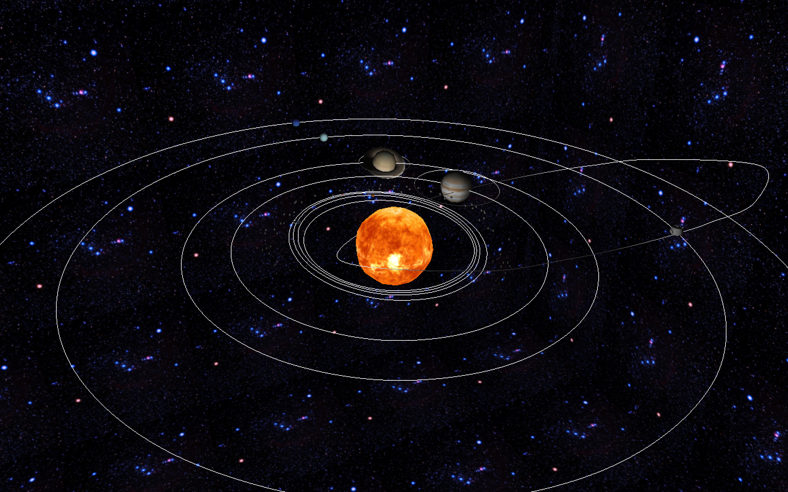

# Engine and Generator of 3D Scenes
Projeto Computação Gráfica 2017/2018, Mestrado Integrado em Engenharia Informática, Universidade do Minho, Braga - Portugal

O projeto tem como objetivo o desenvolvimento de um gerador de figuras e um motor 3D para desenhar cenas (conjunto de objetos) dinâmicas. Este projeto está dividido em 4 fases.

### Pré-Requisitos

  - C 
  - C++
  - CMake 
  - OpenGL

### Resultado

## Autores

* [Joel Rodrigues](https://github.com/JoelRodrigues58)
* [Raphael Oliveira](https://github.com/raphael28)
* [Francisco Araújo](https://github.com/franciscoaraujo51)
* [Fábio Araújo](https://github.com/narcos088)
